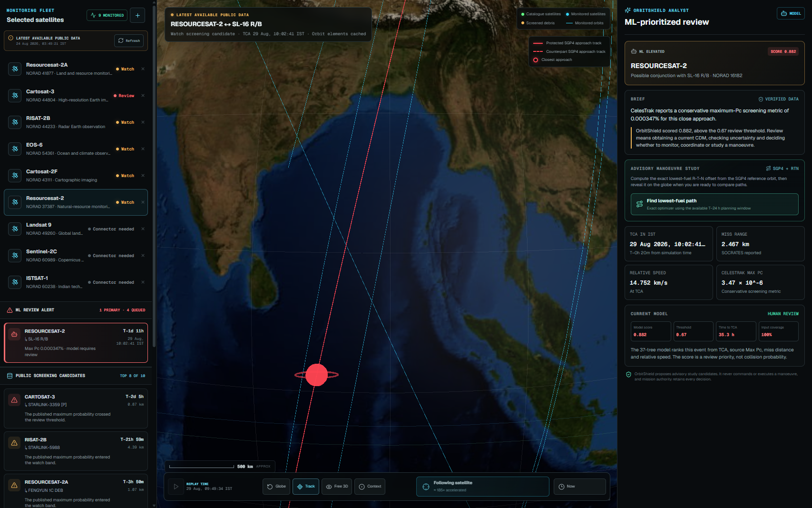
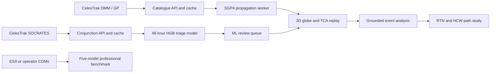

# OrbitShield AI

[](https://github.com/aswanth-07/orbitshield-ai/actions/workflows/ci.yml)

Orbital conjunction monitoring, ML review prioritization, and advisory path studies in one interactive workspace.



OrbitShield helps a small satellite team answer three questions quickly:

1. Which close approaches deserve human review?
2. What will the protected satellite and counterpart look like at the time of closest approach?
3. Which small, early orbital adjustment is worth evaluating with mission-grade tools?

The prototype combines current public screening data, a trained review-priority model, SGP4 orbit propagation, an accelerated closest-approach replay, and a fuel-aware advisory manoeuvre study. It remains usable during a disconnected demo through timestamped local snapshots.

## Product flow

1. **Monitor a fleet.** Add or remove satellites from the monitoring list. The default configuration follows nine Earth-observation and technology missions.
2. **Screen current conjunctions.** CelesTrak OMM/GP records provide orbital elements. SOCRATES provides published close-approach metrics such as TCA, range, relative speed, and maximum probability.
3. **Prioritize analyst attention.** A 37-tree Histogram Gradient Boosting model scores complete events within its trained 48-hour horizon. Elevated scores enter the ML review queue.
4. **Investigate on the globe.** SGP4 propagates the selected objects while the replay follows the final 20 minutes to TCA. Protected and counterpart tracks use distinct visual treatments, and the closest-approach location is marked on the globe.
5. **Review an advisory path.** OrbitShield tests small impulses in the radial, along-track, and cross-track directions. The system ranks valid candidates by estimated propellant, path displacement, and lead time.

## What the model predicts

The live model predicts **review priority**, not collision probability. It receives four fields that are available in the public screening feed:

- time remaining to TCA;
- current `log10(Pc)` screening value;
- predicted miss distance;
- relative speed.

Its output is a score from 0 to 1. A score above the trained threshold raises an analyst-review alert. The current event-held-out test results are F2 `0.631`, recall `0.933`, and PR-AUC `0.529` at a threshold of `0.67`.

OrbitShield keeps the live public-data model separate from the professional CDM research lane:

| Lane | Input | Output | Current role |
| --- | --- | --- | --- |
| Public monitoring | CelesTrak OMM/GP and SOCRATES fields | Screening queue, SGP4 geometry, and ML review score | Runs in the main workspace |
| Professional research | ESA conjunction data message histories through T-2 days | Final high-risk classification benchmark | Demonstrates the future operator-data tier |

The ESA benchmark compares Logistic Regression, Random Forest, Histogram Gradient Boosting, LightGBM, and a Multi-Layer Perceptron across 1,792 held-out events. Histogram Gradient Boosting is the current validation-selected champion with test F2 `0.846` and recall `0.917`. These benchmark results do not score a SOCRATES-only event because the public feed lacks the complete CDM feature set.

## Advisory manoeuvre study

The path study uses a fast physics screening chain:

- **SGP4** supplies the reference orbit.
- **RTN coordinates** define radial (`R`), along-track (`T`), and cross-track (`N`) impulse directions.
- **Hill-Clohessy-Wiltshire relative motion** estimates how a small impulse changes separation at the source TCA.
- **The ideal rocket equation** estimates propellant use from spacecraft mass and specific impulse.
- **A thrust estimate** converts propellant use into an approximate firing duration.

The result is a candidate for flight-dynamics review. A true post-manoeuvre collision probability still requires operator ephemeris, CDM covariance, hard-body radius, attitude and thruster constraints, and a full-catalogue secondary-conjunction re-screen.

## Architecture



API responses report whether data is current, cached, bundled, or unavailable. A failed upstream request falls back to the timestamped repository snapshots instead of fabricating a live result.

## Technology

- Next.js 16, Vinext, React 19, and TypeScript
- Three.js and `react-globe.gl`
- `satellite.js` for SGP4 propagation
- Vitest and ESLint
- Python and scikit-learn compatible tooling for model training
- Cloudflare-compatible deployment through Sites

## Run locally

### Requirements

- Node.js 22.20.0 or newer
- npm 10 or newer
- A WebGL-capable browser

### Start the application

```powershell
git clone https://github.com/aswanth-07/orbitshield-ai.git
cd orbitshield-ai
npm ci
npm run dev
```

Open [http://localhost:3000](http://localhost:3000). No API key is required for the default public-data and offline-snapshot flow.

### Validate the application

```powershell
npm test
npm run lint
npx tsc --noEmit --incremental false
npm run build
```

## Reproduce the ML work

The repository does not commit the Python virtual environment or generated model artifacts. Create them locally:

```powershell
python -m venv .venv-ml
.\.venv-ml\Scripts\python.exe -m pip install -r .\ml\requirements.txt
.\.venv-ml\Scripts\python.exe .\ml\benchmark_models.py
.\.venv-ml\Scripts\python.exe .\ml\train_public_triage.py
```

See [`ml/README.md`](ml/README.md) for the expected dataset layout, leakage-safe event splits, and export commands. ESA event `9051` remains excluded from training and is reserved for the validation replay.

## Repository structure

```text
orbitshield-ai/
├── app/
│   ├── api/                  # Catalogue, conjunction, live-feed, and model routes
│   ├── data/                 # Timestamped fallbacks and deployable model artifacts
│   ├── lib/                  # Orbital, screening, model, and manoeuvre logic
│   ├── workers/              # Client-side SGP4 propagation worker
│   └── *.tsx                 # Globe, monitoring, replay, and analysis surfaces
├── docs/images/              # Repository screenshots
├── ml/                       # Training, benchmarking, and replay export pipeline
├── public/                   # Earth texture, favicon, and social preview
├── scripts/                  # Data preparation and snapshot utilities
├── wiki/                     # Architecture, model, product, and verification notes
└── .openai/hosting.json      # Sites project binding
```

## Data sources and attribution

- [CelesTrak GP data formats](https://celestrak.org/NORAD/documentation/gp-data-formats.php)
- [CelesTrak SOCRATES](https://celestrak.org/SOCRATES/)
- [ESA Collision Avoidance Challenge dataset](https://kelvins.esa.int/collision-avoidance-challenge/data/)
- [SGP4 reference implementation report](https://celestrak.org/NORAD/documentation/spacetrk.pdf)
- [NASA Blue Marble](https://visibleearth.nasa.gov/collection/1484/blue-marble)

The bundled public records are timestamped demonstration fallbacks. Upstream providers remain authoritative.

## Technical notes

- [`wiki/product.md`](wiki/product.md): customer problem and demonstration flow
- [`wiki/architecture.md`](wiki/architecture.md): data lanes, APIs, caching, and model boundaries
- [`wiki/model-benchmark.md`](wiki/model-benchmark.md): five-model evaluation and selection policy
- [`wiki/verification.md`](wiki/verification.md): supported validation checks

## Safety boundary

OrbitShield is a hackathon decision-support prototype. It does not confirm a collision, calculate an operational post-manoeuvre probability from public data, command a spacecraft, or replace a qualified flight-dynamics team.
